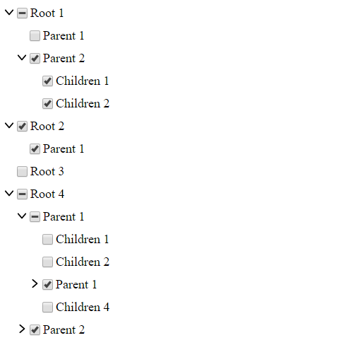

# react-dynamic-checkbox-tree

[](https://app.netlify.com/sites/modest-varahamihira-1caac8/deploys)
[](https://circleci.com/gh/nikorudnas/react-dynamic-checkbox-tree)
[](https://www.npmjs.com/package/react-dynamic-checkbox-tree)
[](https://david-dm.org/nikorudnas/react-dynamic-checkbox-tree)
[](https://david-dm.org/nikorudnas/react-dynamic-checkbox-tree?type=dev)

Demo: https://modest-varahamihira-1caac8.netlify.com/



## Features

- No dependencies
- Size only _2.8_ kb (gzipped)
- For React 15.x and 16.x.
- Styles customizable

## Usage

### Installation

Install the library using your favorite dependency manager:

Using yarn:

```
yarn add react-dynamic-checkbox-tree
```

Using npm:

```
npm install react-dynamic-checkbox-tree --save
```

### Render Component

```jsx
import React from 'react'
import CheckboxTree from 'react-dynamic-checkbox-tree'

const exampleData = [
  {
    id: 1000,
    label: 'Root 1',
    children: [
      { id: 1100, label: 'Children 1' },
      {
        id: 1200,
        label: 'Parent 1',
        children: [
          { id: 1210, label: 'Children 1' },
          { id: 1220, label: 'Children 2' },
        ],
      },
    ],
  },
  {
    id: 2000,
    label: 'Root 2',
    children: [{ id: 2100, label: 'Children 1' }],
  },
  {
    id: 3000,
    label: 'Root 3',
  },
  {
    id: 4000,
    label: 'Root 4',
    children: [
      {
        id: 4100,
        label: 'Parent 1',
        children: [
          { id: 4110, label: 'Children 1' },
          { id: 4120, label: 'Children 2' },
          {
            id: 4130,
            label: 'Parent 1',
            children: [
              { id: 4131, label: 'Children 1' },
              { id: 4132, label: 'Children 2' },
              { id: 4133, label: 'Children 3' },
            ],
          },
          { id: 4140, label: 'Children 3' },
        ],
      },
      {
        id: 4200,
        label: 'Parent 2',
        children: [
          { id: 4210, label: 'Children 1' },
          { id: 4220, label: 'Children 2' },
          { id: 4230, label: 'Children 3' },
          { id: 4240, label: 'Children 4' },
          { id: 4250, label: 'Children 5' },
        ],
      },
    ],
  },
]

export default class MyComponent extends React.Component {
  state = {
    checked: [], // This stores the checked ID's
  }

  render() {
    return (
      <CheckboxTree
        nodes={exampleData}
        checked={this.state.checked}
        onCheck={checked => this.setState({ checked })}
      />
    )
  }
}
```

## API

| Prop                      | Type       | Description                                                                                                                                                                                 |
| ------------------------- | ---------- | ------------------------------------------------------------------------------------------------------------------------------------------------------------------------------------------- |
| `nodes`                   | `array`    | Required. Array of objects. Objects must have id (number) and label (string), optionally children. Children has the same format, array of objects: (id, label and optionally more children) |
| `checked`                 | `array`    | Required. Array of numbers (id). Should derive from state (this.state.checked). If empty, no checkboxes are checked by default                                                              |
| `onCheck`                 | `function` | Required. Function to update the state when nodes are checked. Should not be modified. See the example                                                                                      |
| _Customize: classes_      |            |                                                                                                                                                                                             |
| `classNameNodeContainer`  | `String`   | Optional. `class` for the container.                                                                                                                                                        |
| `classNameLabel`          | `String`   | Optional. `class` for a label.                                                                                                                                                              |
| `classNameParentLabel`    | `String`   | Optional. `class` a parent label.                                                                                                                                                           |
| `classNameCheckbox`       | `String`   | Optional. `class` for a checkbox.                                                                                                                                                           |
| `classNameCheckboxIcon`   | `String`   | Optional. `class` for a checkbox icon.                                                                                                                                                      |
| _Customize: inline-style_ |            |                                                                                                                                                                                             |
| `styleNodeContainer`      | `object`   | Optional. `style` for the container.                                                                                                                                                        |
| `styleLabel`              | `object`   | Optional. `style` for a label.                                                                                                                                                              |
| `styleParentLabel`        | `object`   | Optional. `style` for a parent label.                                                                                                                                                       |
| `styleCheckbox`           | `object`   | Optional. `style` for a checkbox.                                                                                                                                                           |
| `styleCheckboxIcon`       | `object`   | Optional. `style` for a checkbox icon.                                                                                                                                                      |
